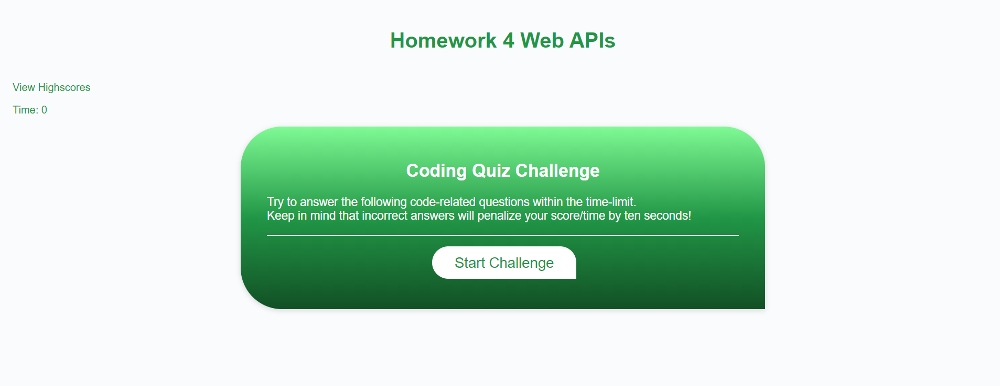
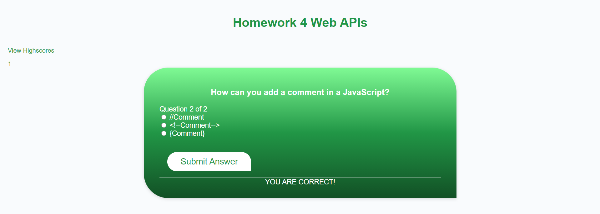
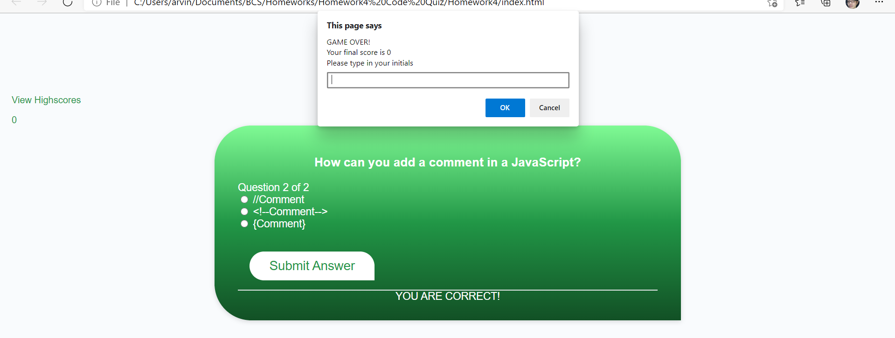
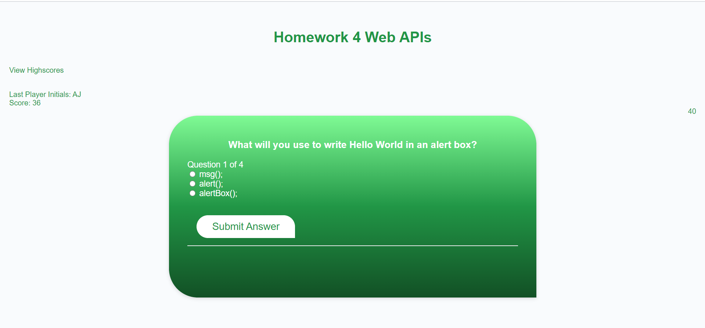

# 04 Web APIs: Code Quiz

## Description
Web based quiz game. In this particular work, the questions are all about Javascsript programming with three choices each, the whole series is timed and can see the last player initials and his/her score. Score is based on time, wrong answers will lead to deduction of time, the game is over when the questions are all answered or timer reaches 0.

- This project uses time interval, local storage, data attributes, to test what I learned from Week 2 (15 MAR - 19 MAR) 
- To make learning fun and with more twists, build a coding quiz on a web page!
- Learned the procedures of making a timer-based algorithm, storing arrays/object into local storage in string form(otherwise it will be declared as undefined), converting it back to object when displaying/comparing, making codes more neat and efficient by using functions(making repetitive lines of codes into an on call function)

### Screenshots
The following image shows the web application's appearance and functionality:

- Main user-interface.

- Question got correct.

- Instance when time runs out.

- Upon Start Challenge button click.

#### URLs
https://irvinek01.github.io/Homework4/
https://github.com/irvinek01/Homework4

##### SPECIAL THANKS
- https://www.codemahal.com/video/javascript-quiz-tutorial/

- Mr. John
- Maam Janani
- My Whole class
- Would like to commend the following persons for helping directly(guiding me what to do next)/indirectly(asking questions to the instructors that I'm not aware of):
  ~ Oliver Shi
  ~ Elvis Lee
  ~ Brian Hernandez
  ~ William Lucht
  ~ Tyler Abegg
