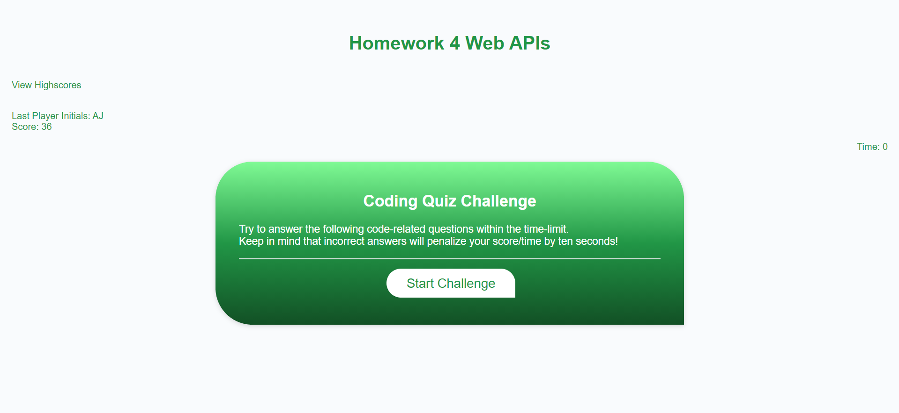
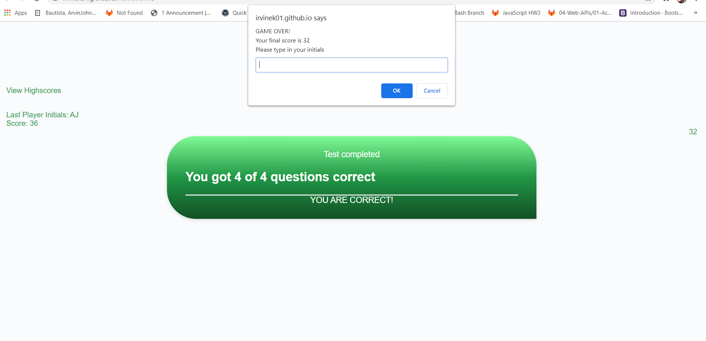
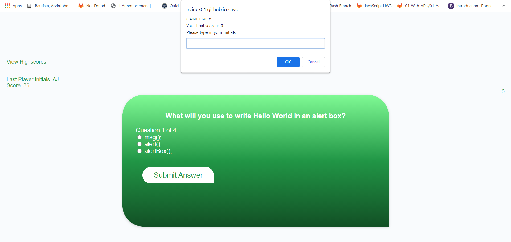

# 04 Web APIs: Code Quiz

## Description
Web based quiz game. In this particular work, the questions are all about Javascsript programming with three choices each, the whole series is timed and can see the last play

- Many conditional statements firing then looping, to test what I learned from Week 2 (15 MAR - 19 MAR) 
- To help ease of thinking complex passwords by just the click of a button (And a series of pop up boxes)
- Learned array looping, getting values from different popup boxes (confirm, alert and prompt), using Boolean values to trigger functions and to turn them off, input validations checks(series of if else if conditional statements)

### Screenshots
The following image shows the web application's appearance and functionality:

- Main user-interface.

- Question got correct.

- Instance when time runs out.

- Upon Start Challenge button click.

#### URLs
https://irvinek01.github.io/Homework4/
https://github.com/irvinek01/Homework4

##### SPECIAL THANKS
- https://www.codemahal.com/video/javascript-quiz-tutorial/

- Mr. John
- Maam Janani
- My Whole class
- Would like to commend the following persons for helping directly(guiding me what to do next)/indirectly(asking questions to the instructors that I'm not aware of):
  ~ Oliver Shi
  ~ Elvis Lee
  ~ Brian Hernandez
  ~ William Lucht
  ~ Tyler Abegg
